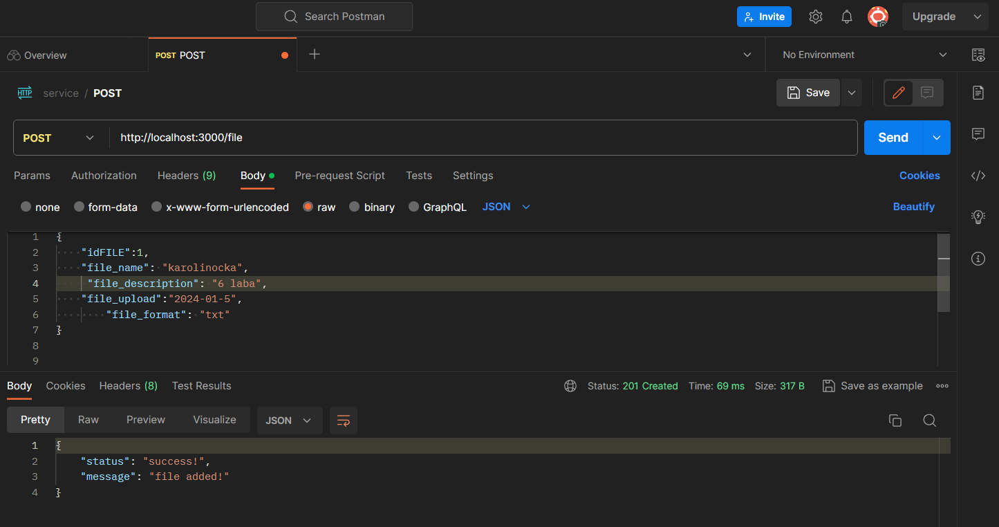
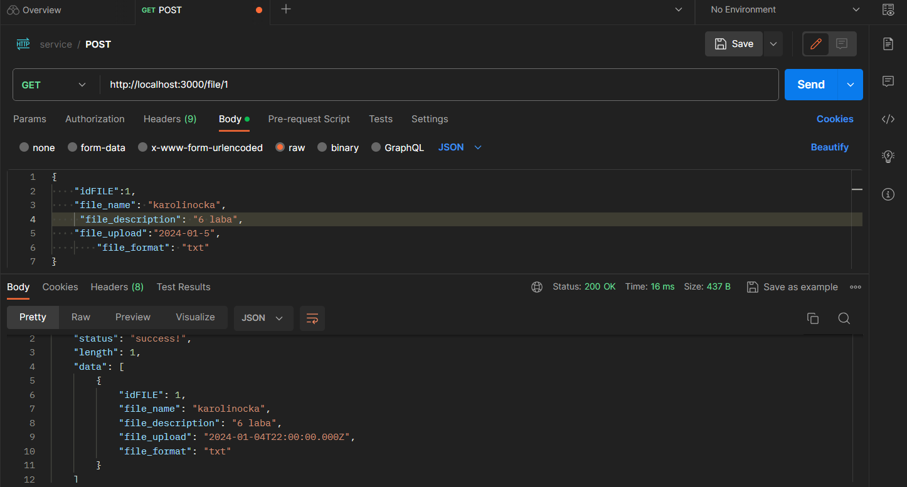
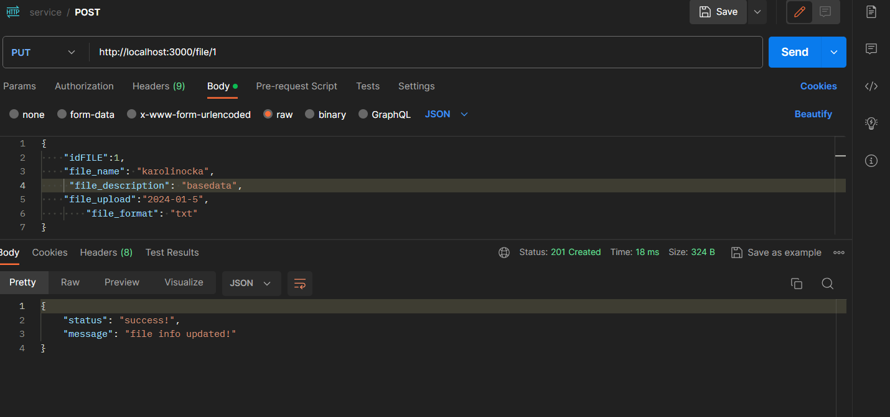
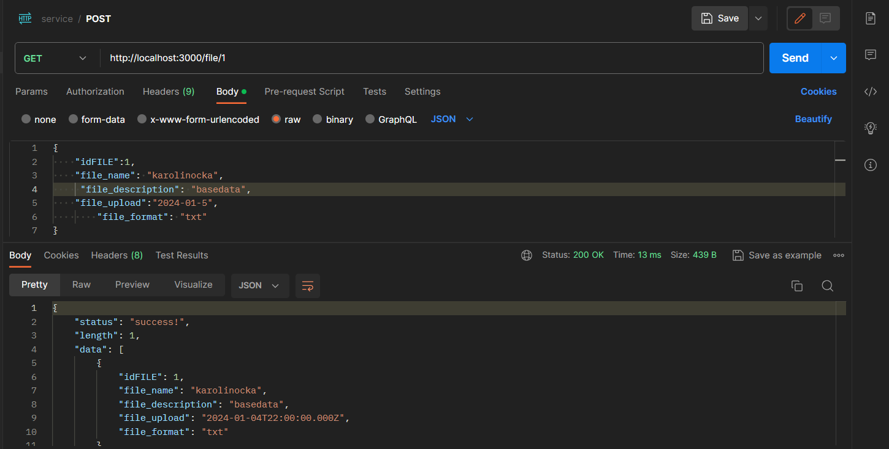
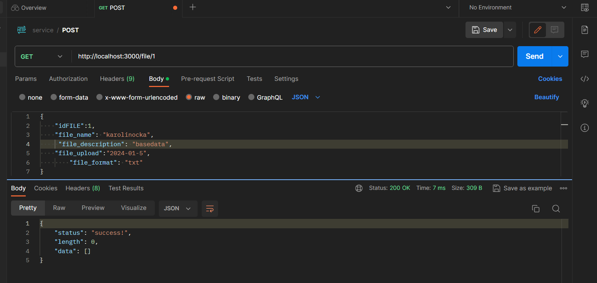

# Тестування серверу 

## Створення файла (**Post** запит)

## Отримання даних (**Get** запит)

## Оновлення даних (**Put** запит)

## Отримання оновлених даних (**Get** запит)

## Видалення файлу (**Delete** запит)

## Видалення неіснуючого файлу 

